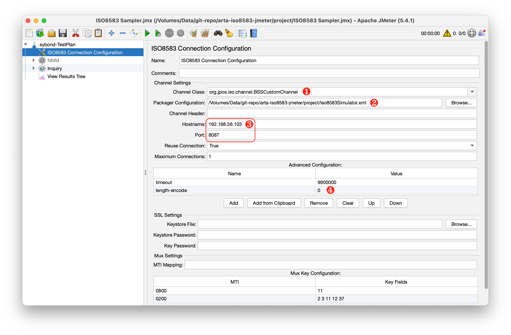
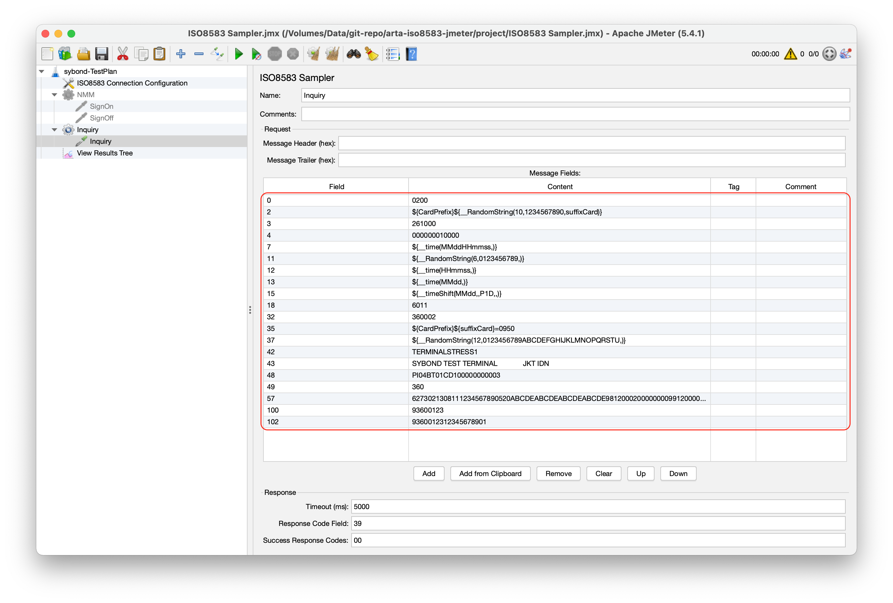
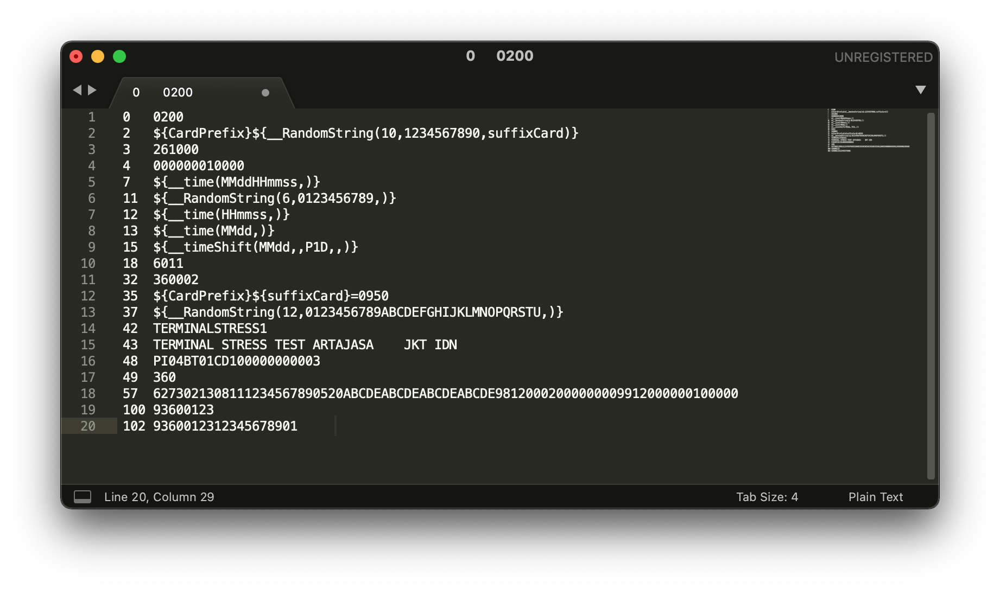

# Configuring ISO8583 Simulator

## Modify `ISO8583 Sampler.jmx`
This is the fast way to configure. Just clone this repository, and open `.jmx` file located in `iso8583-Sampler`.
```shell
git clone https://github.com/sybond/sybond-JMeter-Simulator.git
```

## Configuring the connection parameter

1. Set Channel Class to `org.jpos.iso.channel.BSSCustomChannel`
2. Load your jPOS packager definition `.xml` file
3. Set hostname and port, to let the JMeter as client. Or you can set only the port so act as server.
4. Add new configuration, `length-encode`. This parameter used by the `BSSCustomChannel` to determine TCP length encoding type. Currently supports:
  - `0` to configure using exclude tcp length encoding (commonly used with payment system application: BASE24, SmartVista..)
  - `1` to configure using include tcp length encoding

## Configuring the messages
This part is used to configure your ISO8583 message. Every message can be configured in the thread item. In my example I created NMM and Inquiry thread.

From the selected thread select **Add > Sampler > ISO8583 Sampler**. Select the sampler item, an you can see following screen.


Each sampler will be compiled to generate one ISO8583 message that when the thread is running, it will sent by JMeter to any configured end-point. You can configure multiple sampler in one thread.

Following is my suggestion:
```
Tesplan
   ┗ ISO8583 Connection Configuration
   ┗ Thread1
      ┗ Message1
      ┗ Message2
      ┗ Message3
      ┗ Message4
   ┗ Thread2
      ┗ Message1
      ┗ Message2
```

Following function in JMeter I found very handy:

|Function|Desc|
|---|---|
|`${your_variable_name}`|You can set any value to `your_variable_name` in thread group/or test plan|
|`${__RandomString(10,1234567890,suffixCard)}`|Generate 10 digit random string (using number char) and put the result into `suffixCard` variable|
|`${__time(MMddHHmmss,YourVar)}`|Get current date time with specific format, and put into `YourVar` variable|
|`${__timeShift(MMdd,,P1D,,)}`|Increment current date by `P1D` (plus one day)|

You can always set the message setting in your favorite text editor, just make sure its separated by `\t` (tab) character.


